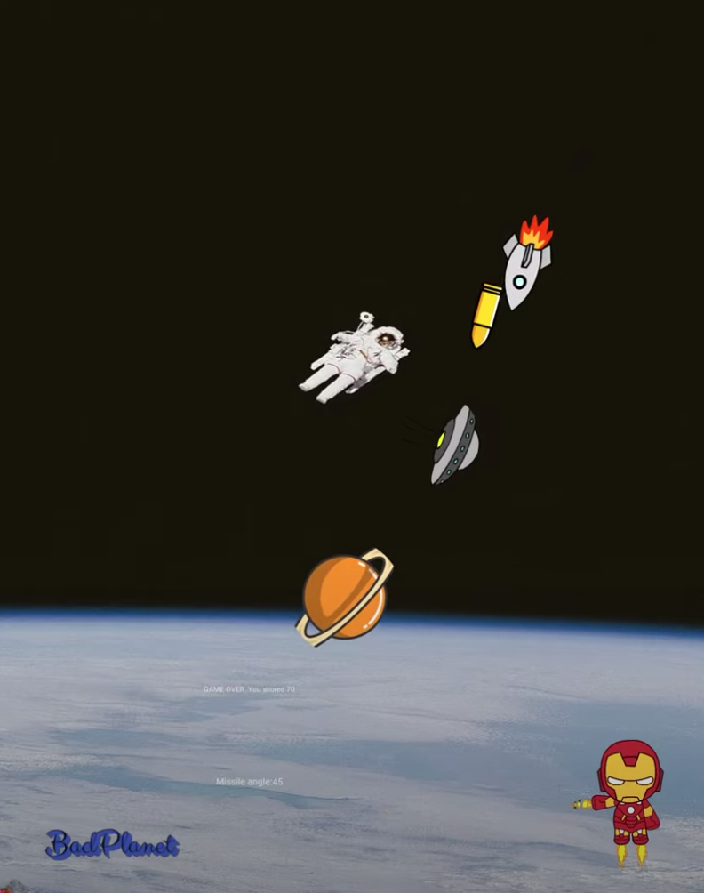

# BadPlanet on Kivy

A new edition of classic game Asteroids controlled by gestures. Or Keyboard!

You can run the badplanet_v1.py game in your laptop, but it is optimized currently for Phones and Tablets only. So, you can compile the kivy project to xcode and run it on your iOS device. Or other devices. This is still in development, but I do not have much time to work on this. Upcoming modules:
* AI controlled Spaceship and Ironman
* Multiplayer option through server. 
